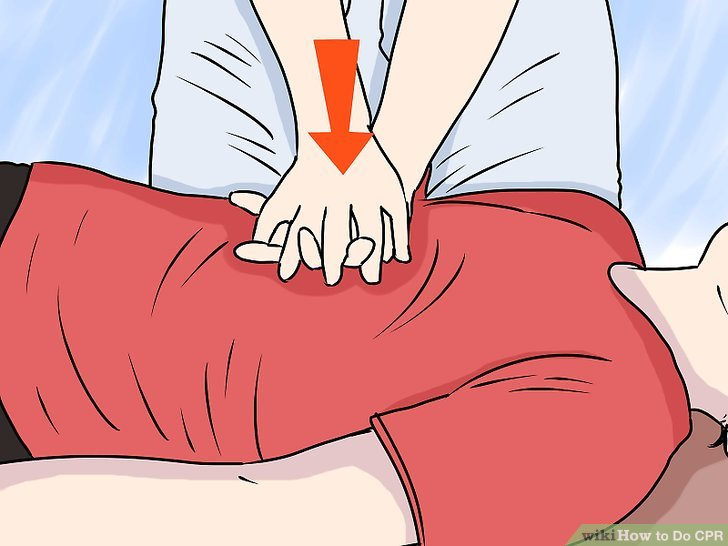

## CPR Instructions
CPR (Cardiopulmonary Resuscitation) is a life-saving technique that can help someone who is experiencing cardiac arrest. It involves performing chest compressions and rescue breaths to circulate blood and oxygen throughout the body.

## NOTE:
If you are not trained in CPR, you can still help by calling 911 and performing **hands-only CPR**. Hands-only CPR involves giving chest compressions only, without rescue breaths.

## Here are the steps for performing CPR:

**1. Check for breathing.** Look for chest rise and fall for no more than 10 seconds. If the person is not breathing, begin CPR.

<!--  -->

**2. Position the person.** Place the person on their back on a firm surface.

**3. Perform chest compressions:**

<!--  -->

<!--  -->

 - Kneel beside the person.
 - Place the heel of your hand in the center of the person's chest.
 - Place your other hand on top of the first hand and interlock your fingers.
 - Push hard and fast in the center of the chest at a rate of 100-120 compressions per minute.   
 - Allow the chest to recoil completely between compressions.*

**4. Give rescue breaths:** (ONLY IF TRAINED IN CPR)

<!--  -->

 - Tilt the person's head back and lift the chin.
 - Pinch the nose closed.
 - Give two rescue breaths, each lasting about 1 second.
 - Watch for chest rise.

### Continue CPR
Continue giving chest compressions and rescue breaths at a ratio of 30 compressions to 2 breaths.
If you are not trained in CPR, continue giving chest compressions only.

#### Keep performing CPR until:
- Emergency medical services arrive.
- The person shows signs of life, such as breathing or moving.
- You become too exhausted to continue.
