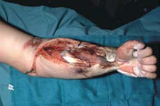

# Electrical Safety: Safety & Health for Electrical Trades Student Manual (2009-113)
DHHS (NIOSH) Publication Number 2009–113
(supersedes 2002–123)
April 2009

## Disclaimer

Mention of any company or product does not constitute endorsement by the National Institute for Occupational Safety and Health (NIOSH). In addition, citations to Web sites external to NIOSH do not constitute NIOSH endorsement of the sponsoring organizations or their programs or products. Furthermore, NIOSH is not responsible for the content of these Web sites. All Web addresses referenced in this document were accessible as of the publication date.

## ORDERING INFORMATION
This document is in the public domain and may be freely copied or reprinted. To ­receive
NIOSH documents or more information about occupational safety and health topics, ­contact
NIOSH at cdcinfo@cdc.gov  or visit the NIOSH Web site at https://www.cdc.gov/niosh

## Foreword
The National Institute for Occupational Safety and Health (NIOSH) esti-
mates that 230,000 young workers under the age of 18 suffer work-related
injuries in the United States each year. Young and new workers have a high
risk for work-related injury compared with more experienced workers.
Occupational safety and health training remains a fundamental element of
hazard control in the workplace, and there is great potential to reduce these
incidents through pre-employment training. Effective pre-employment
training should include realistic environments and hands-on exercises.
However, NIOSH recommends that actual employment in the electrical
trades or any of the other construction trades be delayed until individuals
reach the minimum age of 18.

This student manual is part of a safety and health curriculum for secondary
and post-secondary electrical trades courses. The manual is designed to
engage the learner in recognizing, evaluating, and controlling hazards associ-
ated with electrical work. It was developed through extensive research with
vocational instructors, and we are grateful for their valuable contributions.

Christine M. Branche, Ph.D.

 Acting Director,  National Institute for Occupational Safety and Health
 Centers for Disease Control and Prevention

 ## Acknowledgments
 This document was prepared by Thaddeus W. Fowler, Ed.D. and Karen K. Miles, Ph.D., Education and Information Division (EID) of the
National Institute for Occupational Safety and Health (NIOSH). Editorial services were provided by John W. Diether and Rodger L. Tatken. Pauline Elliott, Gino Fazio, and Vanessa Becks provided layout and
design services.

The authors wish to thank John Palassis and Diana Flaherty (NIOSH),
Robert Nester (formerly of NIOSH), and participating teachers and stu-
dents for their contributions to the development of this document.

This document was updated by Michael McCann, Ph.D., CIH, Director
of Safety Research, CPWR-Center for Construction Research and
Training and Carol M. Stephenson, Ph.D., NIOSH.

## Section 1. Electricity is Dangerous
Whenever you work with power tools or on electrical circuits, there
is a risk of electrical hazards, especially electrical shock. Anyone
can be exposed to these hazards at home or at work. Workers are
exposed to more hazards because job sites can be cluttered with
tools and materials, fast-paced, and open to the weather. Risk is also
higher at work because many jobs involve electric power tools.

Electrical trades workers must pay special attention to electrical haz-
ards because they work on electrical circuits. Coming in contact with
an electrical voltage can cause current to flow through the body,
resulting in electrical shock and burns. Serious injury or even death
may occur. As a source of energy, electricity is used without much
thought about the hazards it can cause. Because electricity is a famil-
iar part of our lives, it often is not treated with enough caution. As a
result, an average of one worker is electrocuted on the job every day
of every year!

This manual will present many topics. There are four main types of
electrical injuries: electrocution (death due to electrical shock),
electrical shock, burns, and falls. The dangers of electricity, electri-
cal shock, and the resulting injuries will be discussed. The various
electrical hazards will be described. You will learn about the safety
model, an important tool for recognizing, evaluating, and control-
ling hazards. Important definitions and notes are shown in the mar-
gins. Practices that will help keep you safe and free of injury are
emphasized. To give you an idea of the hazards caused by electricity,
case studies about real-life deaths will be described.

### How is an electrical shock received?
An electrical shock is received when electrical current passes
through the body. Current will pass through the body in a variety of
situations. Whenever two wires are at different voltages, current will
pass between them if they are connected. Your body can connect the
wires if you touch both of them at the same time. Current will pass
through your body.

In most household wiring, the black wires and the red wires are at 120 volts. The white wires are at 0 volts because they are connected to ground. The connection to ground is often through a conducting ground rod driven into the earth. The connection can also be made
through a buried metal water pipe. **If you come in contact with an energized black wire—and you are also in contact with the neutral white wire—current will pass through your body. You will receive an electrical shock.**

**If you are in contact with a live wire or any live component of an energized electrical device—and also in contact with any
grounded object—you will receive a shock.** Plumbing is often grounded. Metal electrical boxes and conduit are grounded.
Your risk of receiving a shock is greater if you stand in a puddle of
water. But you don’t even have to be standing in water to be at risk.
Wet clothing, high humidity, and perspiration also increase your
chances of being electrocuted. Of course, there is always a chance of
electrocution, even in dry conditions.

You can even receive a shock when you are not in contact with an
electrical ground. Contact with both live wires of a 240-volt cable
will deliver a shock. (This type of shock can occur because one live
wire may be at +120 volts while the other is at -120 volts during an
alternating current cycle—a difference of 240 volts.). You can also
receive a shock from electrical components that are not grounded
properly. Even contact with another person who is receiving an electrical shock may cause you to be shocked.

### Case Studies
| **Case Study 1** |
| --- |
| *A 30-year-old male electrical technician was helping a company service representative test the voltage-regulating unit on a new rolling mill. While the electrical technician went to get the equipment service manual, the service representative opened the panel cover of the voltage regulator’s control cabinet in preparation to trace the low-voltage wiring in question (the wiring was not color-coded). The service representative climbed onto a nearby cabinet in order to view the wires. The technician returned and began working inside the control cabinet, near exposed, energized electrical conductors. The technician tugged at the low-voltage wires while the service representative tried to identify them from above. Suddenly, the representative heard the victim making a gurgling sound and looked down to see the victim shaking as though he were being shocked. Cardiopulmonary resuscitation (CPR) was administered to the victim about 10 minutes later. He was pronounced dead almost 2 hours later as a result of his contact with an energized electrical conductor.   To prevent an incident like this, employers should take the following steps: <ul><li>Establish proper rules and procedures on how to access electrical control cabinets without getting hurt. <li>Make sure all employees know the importance of de-energizing (shutting off) electrical systems before performing repairs. <li> Equip voltage-regulating equipment with color-coded wiring. <li> Train workers in CPR.</ul> *|
| **Case Study 2** |
| *A maintenance man rode 12 feet above the floor on a motorized lift to work on a 277-volt light fixture. He did not turn off the power supply to the lights. He removed the line fuse from the black wire, which he thought was the “hot” wire. But, because of a mistake in installation, it turned out that the white wire was the “hot” wire, not the black one. The black wire was neutral. He began to strip the white wire using a wire stripper in his right hand. Electricity passed from the “hot” white wire to the stripper, then into his hand and through his body, and then to ground through his left index finger. A coworker heard a noise and saw the victim lying face-up on the lift. She immediately summoned another worker, who lowered the platform. CPR was performed, but the maintenance man could not be saved.   He was pronounced dead at the scene.  You can prevent injuries and deaths by remembering the following points: <ul><li>If you work on an electrical circuit, test to make sure that the circuit is de-energized (shut off)! <li>Never attempt to handle any wires or conductors until you are absolutely positive that their electrical supply has been shut off. <li>Be sure to lock out and tag out circuits so they cannot be re-energized. <li>Always assume a conductor is dangerous.</ul>*|

### Summary of Section 1
You will receive an electrical shock if a part of your body completes an electrical circuit by: 
- touching a live wire and an electrical ground, or
- touching a live wire to another wire at a different voltage.

## Section 2: Dangers of Electrical Shock
The severity of injury from electrical shock depends on the amount
of electrical current and the length of time the current passes
through the body. For example, 1/10 of an ampere (amp) of electricity going through the body for just 2 seconds is enough to cause
death. The amount of internal current a person can withstand and
still be able to control the muscles of the arm and hand can be less
than 10 milliamperes (milliamps or mA). Currents above 10 mA
can paralyze or “freeze” muscles. When this “freezing” happens, a
person is no longer able to release a tool, wire, or other object. In
fact, the electrified object may be held even more tightly, resulting
in longer exposure to the shocking current. For this reason, hand-held tools that give a shock can be very dangerous. If you can’t let
go of the tool, current continues through your body for a longer
time, which can lead to respiratory paralysis (the muscles that control breathing cannot move). You stop breathing for a period of
time. People have stopped breathing when shocked with currents
from voltages as low as 49 volts. Usually, it takes about 30 mA of
current to cause respiratory paralysis.

Currents greater than 75 mA cause ventricular fibrillation (very
rapid, ineffective heartbeat). This condition will cause death within a
few minutes unless a special device called a defibrillator is used to
save the victim. Heart paralysis occurs at 4 amps, which means the
heart does not pump at all. Tissue is burned with currents greater
than 5 amps.2

The table shows what usually happens for a range of currents
(lasting one second) at typical household voltages. Longer exposure
times increase the danger to the shock victim. For example, a cur-
rent of 100 mA applied for 3 seconds is as dangerous as a current of
900 mA applied for a fraction of a second (0.03 seconds). The mus-
cle structure of the person also makes a difference. People with less
muscle tissue are typically affected at lower current levels. Even low
voltages can be extremely dangerous because the degree of injury
depends not only on the amount of current but also on the length of
time the body is in contact with the circuit.

#### Effects of Electrical Current in the Human Body
| **Current** | **Reaction** |
| --- | --- |
| Below 1 milliampere | Generally not perceptible. |
| 1 milliampere | Faint tingle. |
| 5 milliamperes | Slight shock felt; not painful but disturbing. Average individual can let go. Strong involuntary reactions can lead to other injuries.|
| 6–25 milliamperes (women)    9–30 milliamperes (men) | Painful shock, loss of muscular control. The freezing current or "let-go" range. Individual cannot let go, but can be thrown away from the circuit if extensor muscles are stimulated.[^2]|
| 50–150 milliamperes | Extreme pain, respiratory arrest (breathing stops), severe muscular contractions. Death is possible. |
| 1,000–4,300 ­milliamperes | Rhythmic pumping action of the heart ceases. Muscular contraction and nerve damage occur; death likely. |
| 10,000 milliamperes | Cardiac arrest and severe burns occur. Death is probable. |
| 15,000 milliamperes | Lowest overcurrent at which a typical fuse or circuit breaker opens a circuit! |

[^1]:If the extensor muscles are excited by the shock, the person may be thrown away from the power source. The lowest overcurrent at which a typical fuse or circuit breaker will open is 15,000 milliamps (15 amps).

**High voltages cause additional ­injuries!** Sometimes high voltages lead to additional injuries. High voltages can cause violent muscular contractions. You may lose your balance
and fall, which can cause injury or even death if you fall into
machinery that can crush you. High voltages can also cause severe
burns. 

*Arm with third degree burn from high-voltage line.*

**Higher voltages can cause larger
currents and more severe shocks.** At 600 volts, the current through the body may be as great as
4 amps, causing damage to internal organs such as the heart. High
voltages also produce burns. In addition, internal blood vessels may clot. Nerves in the area of the contact point may be damaged.
Muscle contractions may cause bone fractures from either the con-
tractions themselves or from falls.

**Some injuries from electrical
shock cannot be seen.** A severe shock can cause much more damage to the body than is
visible. A person may suffer internal bleeding and destruction of tis-
sues, nerves, and muscles. Sometimes the hidden injuries caused by
electrical shock result in a delayed death. Shock is often only the
beginning of a chain of events. Even if the electrical current is too
small to cause injury, your reaction to the shock may cause you to
fall, resulting in bruises, broken bones, or even death.

The length of time of the shock greatly affects the amount of injury.
If the shock is short in duration, it may only be painful. A longer shock (lasting a few seconds) could be fatal if the level of current is
high enough to cause the heart to go into ventricular fibrillation.
This is not much current when you realize that a small power drill uses 30 times as much current as what will kill. At relatively high currents, death is certain if the shock is long enough. However, if the shock is short and the heart has not been damaged, a normal heartbeat may resume if contact with the electrical current is eliminated. (This type of recovery is rare.)

**The greater the current, the greater the shock!** 

The amount of current passing through the body also affects the severity of
an electrical shock. Greater voltages produce greater
currents. So, there is greater danger from higher voltages. Resistance hinders current. The lower the resistance (or impedance in AC circuits), the greater the
current flow will be. Dry skin may have a resistance
of 100,000 ohms or more. Wet skin may have a resistance of only 1,000 ohms. Wet working conditions or broken skin will drastically reduce resistance. The low resistance of wet skin allows current to pass into the body more easily and
give a greater shock. When more force is applied to the contact point or when the contact area is larger, the resistance is lower, causing stronger shocks. 

* **Severity of shock depends on
[voltage](#voltage), [amperage](#amperage), and [resistance](#resistance).** 
* **Lower [resistance](#resistance) causes greater currents.**

The path of the electrical current through the body affects the severity of the shock. **Currents through the heart or nervous system are most dangerous.** If you contact a live wire with your head, your nervous system may be damaged. Contacting a live electrical part with one hand--while you are grounded at the other side of your body--will cause electrical current to pass across your chest, possibly injuring your heart and lungs. 

There have been cases where an arm or leg is severely burned by
high-voltage electrical current to the point of coming off, and the
victim is not electrocuted. In these cases, the current passes through
only a part of the limb before it goes out of the body and into another
conductor. Therefore, the current does not go through the chest area
and may not cause death, even though the victim is severely disfig-
ured. If the current does go through the chest, the person will almost
surely be electrocuted. A large number of serious electrical injuries
involve current passing from the hands to the feet. Such a path
involves both the heart and lungs. This type of shock is often fatal.

| **Case Study** |
| --- |
| *A male service technician arrived at a customer’s house to perform pre-winter maintenance on an oil furnace. The customer then left the house and returned 90 minutes later. She noticed the service truck was still in the driveway. After 2 more hours, the customer entered the crawl space with a flashlight to look for the technician but could not see him. She then called the owner of the company, who came to the house. He searched the crawl space and found the technician on his stomach, leaning on his elbows in front of the furnace. The assistant county coroner was called and pronounced the technician dead at the scene. The victim had electrical burns on his scalp and right elbow.    After the incident, an electrician inspected the site. A toggle switch that supposedly controlled electrical power to the furnace was in the “off” position. The electrician described the wiring as “haphazard and confusing.”   Two weeks later, the county electrical inspector performed another inspection. He discovered that incorrect wiring of the toggle switch allowed power to flow to the furnace even when the switch was in the “off” position. The owner of the company stated that the victim was a very thorough worker. Perhaps the victim performed more maintenance on the furnace than previous technicians, exposing himself to the electrical hazard.   This death could have been prevented!   <ul> <li>The victim should have tested the circuit to make sure it was de-energized. <li>Employers should provide workers with appropriate equipment and training. Using safety equipment should be a requirement of the job. In this case, a simple circuit tester may have saved the victim’s life. <li>Residential wiring should satisfy the National Electrical Code (NEC). Although the NEC is not retroactive, all homeowners should make sure their systems are safe.</ul>*

### Summary of Section 2
The danger from electrical shock depends on
* the **amount** of the shocking current through the body,
* the **duration** of the shocking current through the body, and
* the **path** of the shocking current through the body.

# Glossary
###### ampacity
maximum amount of current a wire can carry safely without overheating

###### amperage
  strength of an electrical current, measured in amperes

#### ampere (amp)
unit used to measure current

#### arc-blast
explosive release of molten material from equipment caused by
high-amperage arcs

#### arcing
luminous electrical discharge (bright, electrical sparking) through the air that occurs when high voltages exist across a gap between conductors

#### AWG
American Wire Gauge—measure of wire size

#### bonding
joining electrical parts to assure a conductive path

#### bonding jumper
conductor used to connect parts to be bonded

#### circuit
complete path for the flow of current

#### circuit breaker
overcurrent protection device that automatically shuts off the current
in a circuit if an overload occurs
conductor
material in which an electrical current moves easily
CPR
cardiopulmonary resuscitation—emergency procedure that involves
giving artificial breathing and heart massage to someone who is not
breathing or does not have a pulse (requires special training)
current
movement of electrical charge
de-energize
shutting off the energy sources to circuits and equipment and
depleting any stored energy
double-insulated
equipment with two insulation barriers and no exposed metal parts
energized (live, “hot”)
similar terms meaning that a voltage is present that can cause a
current, so there is a possibility of getting shocked
fault current
any current that is not in its intended path